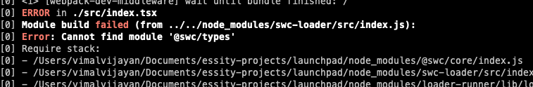

# [Backstage](https://backstage.io)

This is your newly scaffolded Backstage App, Good Luck!

To start the app, run:

```sh
yarn install
yarn dev
```

# Possible erros on modules while yarn dev



Fix
```
yarn install --dev swc-loader
```


yarn --cwd packages/app add @backstage/theme